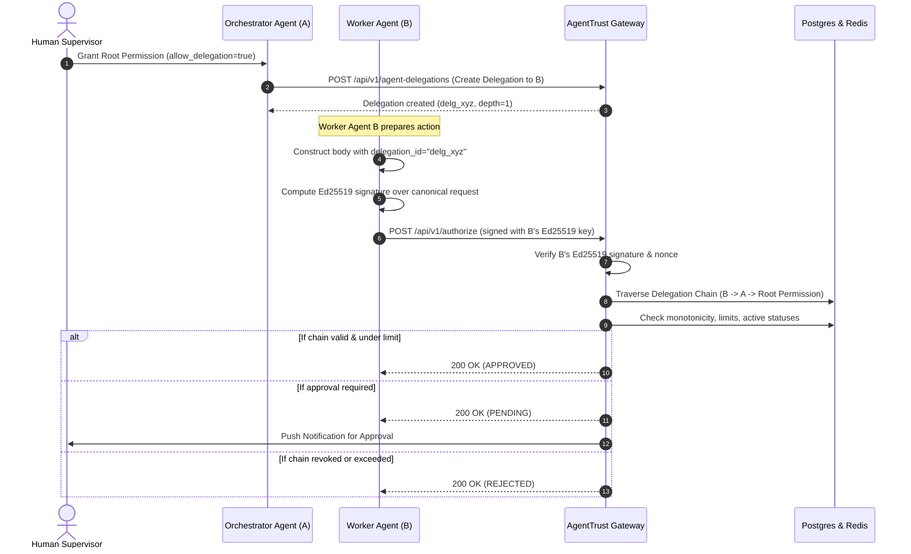

# Secure Agent-to-Agent Trust & Delegation

## 1. Overview

AgentTrust Step 19 introduces **Secure Agent-to-Agent Delegation**. In autonomous multi-agent environments, high-level orchestrator AI agents often need to delegate specialized tasks (e.g., executing a travel booking, initiating a sub-payment, or querying private customer data) to subordinate worker AI agents.

AgentTrust enforces strict security boundaries on inter-agent delegation:
1. **Intra-Organization Boundary**: Delegations are permitted strictly within the same organization. Cross-tenant or cross-organization delegation is rejected.
2. **Monotonicity (Narrower Authority Only)**: A delegated permission can **never** exceed its parent permission in action, resource, monetary limit, or validity window.
3. **Non-Escalation of Human Approval**: If a parent permission requires human approval, every delegation derived from it **must** also require human approval. A delegated agent can never bypass human oversight.
4. **Sub-Delegation Control**: Parent agents can disallow further downstream delegation (`allow_delegation = False`).
5. **Chain & Depth Limits**: Transitive delegations ($A \to B \to C$) are supported up to a maximum delegation depth (default: 3). Self-delegation ($A \to A$) and cyclic delegations ($A \to B \to A$) are strictly prevented.
6. **Immediate Cascade Revocation**: Revoking a parent delegation or root permission immediately stops all downstream child agents from executing actions in real time.
7. **Cryptographic Identity & Anti-Replay**: Child agents sign their own authorization requests using their private Ed25519 keys. The `delegation_id` is incorporated into the request body and canonical request digest, preventing tampering or substitution.

---

## 2. Delegation Rules & Monotonic Constraints

| Property | Rule | Enforcement Mechanism |
| :--- | :--- | :--- |
| **Action** | Must match parent permission action exactly. | Validated on creation and on evaluation. |
| **Resource** | Must match parent permission resource (or be a strictly narrower prefix). | Checked via `verify_delegation_chain`. |
| **Maximum Amount** | Must be $\le$ parent maximum amount. If parent has no monetary limit, child can set one. If parent has a limit, child cannot increase it. | Decimal comparison against root and upstream nodes. |
| **Expiration** | Must expire on or before parent permission / delegation expiration. | Expiry date validation at creation and execution time. |
| **Human Approval** | If parent requires approval, child **must** require approval (`requires_approval = True`). | Prevented from turning off approval. |
| **Downstream Delegation** | Parent can set `allow_delegation = False`. Child cannot delegate further. | Chain traversal verifies `allow_delegation`. |
| **Max Depth** | Configurable, default `settings.delegation_max_depth = 3`. | Enforced during chain construction. |
| **Cycle Detection** | An agent cannot delegate to itself or to any ancestor already in the chain. | Visited set detection ($O(V)$ check). |

---

## 3. Database Schema

### `agent_delegations`
* `id` (`UUID`, Primary Key)
* `delegation_id` (`VARCHAR(36)`, Unique index, e.g. `delg_...`)
* `organization_id` (`UUID`, Foreign Key to `organizations.id`)
* `parent_agent_id` (`UUID`, Foreign Key to `agents.id`)
* `child_agent_id` (`UUID`, Foreign Key to `agents.id`)
* `parent_permission_id` (`UUID`, Foreign Key to `permissions.id`)
* `parent_delegation_id` (`UUID | None`, Foreign Key to self `agent_delegations.id`)
* `action` (`VARCHAR(100)`)
* `resource` (`VARCHAR(255)`)
* `maximum_amount` (`NUMERIC(14, 4) | None`)
* `currency` (`VARCHAR(3) | None`)
* `requires_approval` (`BOOLEAN`)
* `allow_delegation` (`BOOLEAN`, default `True`)
* `depth` (`INTEGER`, default `1`)
* `status` (`SqlEnum: active, revoked, expired`)
* `created_at` (`TIMESTAMP WITH TIME ZONE`)
* `expires_at` (`TIMESTAMP WITH TIME ZONE`)
* `revoked_at` (`TIMESTAMP WITH TIME ZONE | None`)
* `revocation_reason` (`TEXT | None`)

---

## 4. Cryptographic Request Flow



---

## 5. API Reference

### Create Delegation
```http
POST /api/v1/agent-delegations
Authorization: Bearer <user_token>
Content-Type: application/json

{
  "parent_agent_id": "845fa3de-9c10-422f-b8c7-8bb3e31b1ef5",
  "child_agent_id": "a321c603-548a-4584-a420-0ce14302ae7c",
  "parent_permission_id": "c1901844-3232-4422-b258-2debf9a896d1",
  "action": "payments:transfer",
  "resource": "account:123",
  "maximum_amount": 500.00,
  "currency": "USD",
  "requires_approval": false,
  "allow_delegation": true,
  "expires_at": "2026-10-01T00:00:00Z"
}
```

### Get Delegation Chain
```http
GET /api/v1/agent-delegations/delg_0da09d6de99772689a1bfd3c/chain
Authorization: Bearer <user_token>
```
Response returns the full resolution tree, effective limits, and validity status.

### Cascade Revocation
```http
POST /api/v1/agent-delegations/delg_0da09d6de99772689a1bfd3c/revoke
Authorization: Bearer <user_token>
Content-Type: application/json

{
  "reason": "Security incident: child agent compromised"
}
```
All child delegations descending from this delegation are revoked immediately in the same transaction.

---

## 6. SDK & CLI Usage

### Python SDK
```python
from agenttrust import AgentTrust

client = AgentTrust(api_key="at_live_...")
agent = client.agent(
    agent_id="agt_worker_1",
    key_id="key_ag_0da09d6de99772689a1bfd3c",
    private_key_path="./keys/worker_private.pem",
)

# Execute delegated action with cryptographic signing
result = agent.authorize(
    action="payments:transfer",
    resource="account:123",
    amount=250.00,
    currency="USD",
    delegation_id="delg_abc123",
)
print("Decision:", result.status)  # APPROVED
```

### Node.js SDK
```typescript
import { AgentTrust } from "@agenttrust/sdk";

const client = new AgentTrust({ apiKey: "at_live_..." });
const agent = client.agent({
  agentId: "agt_worker_1",
  keyId: "key_ag_0da09d6de99772689a1bfd3c",
  privateKeyPath: "./keys/worker_private.pem",
});

const result = await agent.authorize({
  action: "payments:transfer",
  resource: "account:123",
  amount: 250.00,
  currency: "USD",
  delegationId: "delg_abc123",
});
console.log("Decision:", result.status);
```

### CLI
```bash
# Create delegation
agenttrust delegations create \
  --parent-agent-id "agt_parent" \
  --child-agent-id "agt_child" \
  --parent-permission-id "perm_root" \
  --action "payments:transfer" \
  --resource "account:123" \
  --maximum-amount 500.00

# Inspect chain
agenttrust delegations get delg_abc123 --chain

# Cascade revoke
agenttrust delegations revoke delg_abc123 --reason "Decommissioning child agent"
```
